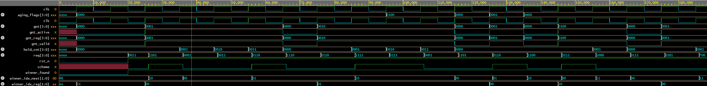

# Multi-Port Bus Arbiter

A parameterizable multi-port bus arbiter implemented in SystemVerilog with a full UVM 1.2 verification environment.

## Overview

In hardware systems, multiple requestors often compete for access to a shared bus. Due to physical limitations, only one requestor can use the bus at a time. This project implements a bus arbiter that manages access to a shared bus across multiple concurrent requestors, supporting two scheduling schemes, starvation prevention via aging counters, and configurable grant hold timeouts.

## Features

- Parameterizable requestor count (default 4)
- Two arbitration schemes selectable at runtime:
  - **Fixed-priority**: lower index requestors have higher priority
  - **Round-robin**: grants rotate fairly across all active requestors
- Grant held until requestor deasserts REQ
- Configurable max-hold timeout that forces re-arbitration if a requestor holds the bus too long
- Aging counter-based starvation prevention: requestors waiting beyond `AGE_THRESHOLD` cycles are temporarily elevated to highest priority
- One-hot GNT output with GNT_VALID indicator
- Active-low synchronous reset

## Architecture

The design is decomposed into three modules:

### `arbiter_top`
Top-level module that instantiates the two submodules and holds all state registers including the current grant, hold counter, and last winner index. Handles grant hold logic, max-hold timeout enforcement, and re-arbitration control.

### `priority_resolver`
Purely combinational module that determines the next winner based on the current scheme. In fixed-priority mode, it first checks aging flags for any elevated requestors before falling through to normal priority order. In round-robin mode, it scans from `last_winner+1` with modulo wrapping to ensure fair rotation.

### `age_counter_block`
Tracks how long each requestor has been waiting without a grant. Counters increment each cycle a requestor is active but not granted, saturate at `AGE_THRESHOLD` to prevent rollover, and reset to zero on grant. Outputs a one-hot `aging_flags` bus consumed by `priority_resolver`.

```
                    ┌─────────────────────────────────────┐
                    │            arbiter_top               │
                    │                                      │
  req[N-1:0] ──────►│  ┌──────────────────────────────┐   │
  scheme     ──────►│  │     priority_resolver        │   │──► gnt[N-1:0]
  clk        ──────►│  │  (combinational)             │   │──► gnt_valid
  rst_n      ──────►│  └──────────────────────────────┘   │
                    │                                      │
                    │  ┌──────────────────────────────┐   │
                    │  │     age_counter_block        │   │
                    │  │  (sequential)                │   │
                    │  └──────────────────────────────┘   │
                    └─────────────────────────────────────┘
```

## Parameters

| Parameter | Default | Description |
|---|---|---|
| `N` | 4 | Number of requestors |
| `MAX_HOLD` | 8 | Maximum cycles a grant can be held before forced re-arbitration |
| `AGE_THRESHOLD` | 4 | Cycles a requestor waits before aging counter elevates its priority |

## Repository Structure

```
multi-port-bus-arbiter/
├── README.md
├── rtl/
│   ├── age_counter_block.sv
│   ├── priority_resolver.sv
│   └── arbiter_top.sv
├── tb/
│   ├── directed/
│   │   └── arbiter_directed_tb.sv
│   └── uvm/
│       ├── arbiter_if.sv
│       ├── arbiter_seq_item.sv
│       ├── arbiter_sequencer.sv
│       ├── arbiter_driver.sv
│       ├── arbiter_monitor.sv
│       ├── arbiter_scoreboard.sv
│       ├── arbiter_agent.sv
│       ├── arbiter_env.sv
│       ├── arbiter_rand_seq.sv
│       ├── arbiter_test.sv
│       └── arbiter_tb_top.sv
├── sim/
│   └── arbiter_directed_tb.vcd
└── docs/
    └── waveform.png
```

## Simulation

### Directed Testbench (Icarus Verilog)

Requires Icarus Verilog installed on WSL/Linux.

```bash
# Compile
iverilog -g2012 -o sim.out \
  rtl/age_counter_block.sv \
  rtl/priority_resolver.sv \
  rtl/arbiter_top.sv \
  tb/directed/arbiter_directed_tb.sv

# Run
vvp sim.out

# View waveforms
gtkwave dump.vcd
```

Tests cover:
1. Single requestor grant
2. Fixed-priority multi-requestor arbitration
3. Grant hold across multiple cycles
4. Grant release and re-arbitration
5. Round-robin rotation across all requestors
6. Max-hold timeout and forced re-arbitration

### UVM Testbench (EDA Playground / Synopsys VCS)

1. Open [EDA Playground](https://edaplayground.com)
2. Select **Synopsys VCS** as the simulator and **UVM 1.2** from the libraries dropdown
3. Add all files from `tb/uvm/` as separate tabs on the testbench side
4. Add all files from `rtl/` as separate tabs on the design side
5. Set the run options to:

```
+incdir+. +UVM_TESTNAME=arbiter_base_test
```

6. Click Run

## Waveform

### UVM Constrained-Random Simulation (Synopsys VCS)


## Results

**Directed testbench:** 6/6 tests passing covering all major behavioral scenarios.

**UVM testbench:** 300 constrained-random transactions with zero UVM errors on Synopsys VCS.

Scoreboard verified:
- GNT is always one-hot or zero (never multiple bits set simultaneously)
- GNT only asserts for requestors with active REQ signals
- No requestor exceeded the starvation threshold in fixed-priority mode
- Grant correctly clears on REQ deassertion and max-hold timeout

Bugs caught during verification:
- Grant register not clearing on REQ deassertion
- Hold counter not resetting on REQ deassertion
- Round-robin start index off by one after reset
- Aging counter width undersized causing starvation prevention to silently fail

## Background

This project is part of an ASIC digital design portfolio targeting roles in RTL design and digital verification. It demonstrates core arbitration design discipline including fixed-priority and round-robin scheduling, starvation prevention via aging counters, parameterizable RTL, and a self-checking UVM 1.2 verification environment with constrained-random stimulus — skills directly applicable to industry ASIC flows at companies working on GPU interconnect, SoC fabric design, and high-performance memory subsystems.